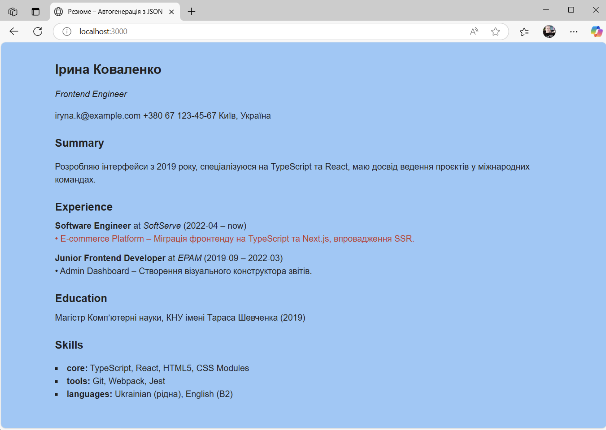

# Домашка - Фінальний проєкт

# «Генератор резюме з JSON‑опису»

## Опис завдання

У цьому фінальному домашньому завданні необхідно реалізувати генератор резюме, який демонструє застосування п'яти патернів проектування: Facade, Template Method, Factory Method, Composite, Decorator.

Завдання має на меті навчити вас:

- Правильно застосовувати патерни проектування в практичних сценаріях
- Створювати модульну, розширювану архітектуру
- Структурувати код з використанням патернів

Необхідно сформувати самодостатню HTML‑сторінку‑резюме, яка будується з єдиного джерела даних — файл `resume.json`. Усі стилі фіксовані у `styles.css`, сторонніх бібліотек або фреймворків не використовуємо. Після компіляції `main.ts` і відкриття `index.html` сторінка повинна безпомилково відобразити повне резюме, а проєкти з прапорцем `"isRecent": true` — підсвітити червоним.

## Структура проекту

```
/
├── index.html                  # Статичний макет сторінки
├── resume.json                 # Джерело даних для сторінки
├── vite.config.js              # Конфігурація Vite
├── tsconfig.json               # Конфігурація TypeScript
├── dist/                       # Директорія для збірки
└── src/
    ├── styles.css              # Базові стилі + .highlight
    ├── facade/
    │   └── ResumePage.ts       # Фасад проєкту
    ├── importer/
    │   ├── AbstractImporter.ts # Базовий Template Method
    │   └── ResumeImporter.ts   # Конкретна реалізація
    ├── blocks/                 # Конкретні блоки резюме
    │   ├── BlockFactory.ts     # Factory Method
    │   ├── HeaderBlock.ts
    │   ├── SummaryBlock.ts
    │   ├── ExperienceBlock.ts  # Composite‑контейнер
    │   ├── ProjectBlock.ts
    │   ├── EducationBlock.ts
    │   └── SkillsBlock.ts
    ├── decorators/
    │   └── HighlightDecorator.ts
    ├── models/
    │   └── ResumeModel.ts      # Типи внутрішньої моделі
    └── main.ts                 # Точка входу
```

## Патерн Facade (Фасад)

- Клас ResumePage
- Призначення — надає спрощений інтерфейс до складної системи генерації резюме
- Реалізація: Метод init(jsonPath) приховує складність завантаження JSON, його обробки та рендерингу

## Патерн Template Method (Шаблонний метод)

- Класи AbstractImporter → ResumeImporter
- Призначення — визначає скелет алгоритму, делегуючи деякі кроки підкласам
- Реалізація:
  - Послідовність операцій validate → map → render, де конкретні кроки реалізуються в ResumeImporter
  - У validate() перевіряємо наявність обов’язкових блоків header, summary, experience, education, skills.
  - У map() трансформуємо «сирий» JSON на внутрішні типи ResumeModel.
  - У render() створюємо BlockFactory, генеруємо блоки та додаємо їх у #resume-content.

## Патерн Factory Method (Фабричний метод)

- Клас BlockFactory
- Призначення — інкапсулює створення об'єктів різних типів
- Реалізація:
  - Метод createBlock(type, model) створює відповідні блоки: Header, Summary, Experience, Education, Skills.
  - Він повертає інстанс класу‑блоку, що реалізує інтерфейс IBlock { render(): HTMLElement }.

## Патерн Composite (Компонувальник)

- Класи ExperienceBlock → ProjectBlock
- Призначення — дозволяє обробляти групи об'єктів так само, як окремі екземпляри
- Реалізація:
  - Клас ExperienceBlock може містити дочірні ProjectBlock елементи, які обробляються рекурсивно.
  - Клас ExperienceBlock виконує рендер секції Experience та рекурсивно додає дочірні ProjectBlock.
  - Клас ProjectBlock — листовий вузол, усередині якого немає дітей.

## Патерн Decorator (Декоратор)

- Клас HighlightDecorator
- Призначення — динамічно розширює функціональність об'єкта без зміни його структури
- Реалізація:
  - Додає візуальне виділення до проєктів з isRecent: true.
  - Приймає HTMLElement проєкт з isRecent: true і додає клас .highlight, не змінюючи внутрішньої логіки рендеру.

## Дані

Файл resume.json уже містить повний приклад структури з п’ятьма логічними блоками. Дозволено редагувати лише значення полів, дотримуючись схеми.

## Очікуваний результат

Після запуску проєкту командами:

```bash
npm install
npm run dev
```

Повинна з'явитися HTML-сторінка резюме з наступними секціями:

- Заголовок з ім'ям та контактами
- Короткий опис (Summary)
- Досвід роботи з проєктами (нещодавні проєкти виділені)
- Освіта
- Навички



Усі дані генеруються динамічно з файлу resume.json. Проекти з атрибутом isRecent: true повинні бути візуально виділені через застосування декоратора.

Функціональність, яку потрібно реалізувати:

- Структура проєкту відповідно до плану вище
- Правильна реалізація кожного з 5 патернів проєктування
- Динамічне створення HTML-сторінки з даних в resume.json
- Візуальне виділення нещодавніх проєктів
- Можливість легкого розширення різних блоків резюме


## Критерії оцінювання (100 балів)

| Категорія | Бали | Опис
|---|---|---
| Реалізація патерну Facade | 15 | Правильна реалізація класу ResumePage як єдиної точки входу. Метод init() приховує деталі завантаження даних, обробки та рендерингу.
| Реалізація патерну Template Method | 15 | Коректна реалізація AbstractImporter з визначеним скелетом алгоритму та абстрактними методами. Клас ResumeImporter правильно реалізує всі абстрактні методи validate, map та render.
| Реалізація патерну Factory Method | 15 | BlockFactory правильно інкапсулює створення різних типів блоків. Метод createBlock() коректно створює відповідні блоки залежно від типу.
| Реалізація патерну Composite | 15 | ExperienceBlock правильно реалізує композицію ProjectBlock елементів. Рекурсивне рендерингу блоків виконано коректно
| Реалізація патерну Decorator | 15 | HighlightDecorator динамічно додає виділення до проєктів з isRecent:true, не змінюючи їх внутрішню структуру.
| Функціональна повнота | 10 | Застосунок коректно відображає всі секції резюме з resume.json. Усі блоки відображаються відповідно до вимог.
| Розширюваність та якість коду | 10 | Код легко розширюється для додавання нових типів блоків. Відсутні дублювання коду. Правильне використання TypeScript типів.
| Документація README.md | 5 | Якісне пояснення реалізації кожного з патернів, інструкції з запуску та розширення проєкту.


## Документація: Реалізація та розширення

### Як у проєкті реалізовано патерни
1. **Facade (Фасад)**: Клас `ResumePage` є єдиною точкою входу. Його метод `init()` інкапсулює завантаження JSON (`fetchData`) та запуск імпортера (`ResumeImporter`). Клієнтський код у `main.ts` максимально простий і не знає про деталі парсингу чи рендерингу.

2. **Template Method (Шаблонний метод)**: Абстрактний клас `AbstractImporter` задає жорсткий скелет алгоритму генерації (`validate -> map -> render`). Конкретний `ResumeImporter` реалізує ці кроки, інкапсулюючи перевірку наявності полів у JSON та використовуючи фабрику для виводу блоків на сторінку.

3. **Factory Method (Фабричний метод)**: Клас `BlockFactory` створює об'єкти різних блоків (`HeaderBlock`, `SummaryBlock` тощо) залежно від типу рядка. Всі створені блоки реалізують спільний інтерфейс `IBlock`, що дозволяє `ResumeImporter` працювати з ними універсально.

4. **Composite (Компонувальник)**: `ExperienceBlock` виступає контейнером (вузлом), який містить інші елементи (`ProjectBlock`). Під час виклику `render()`, він проходить циклом по масиву дочірніх проєктів та рекурсивно викликає їхні методи `render()`, збираючи все в єдине DOM-дерево.

5. **Decorator (Декоратор)**: Клас `HighlightDecorator` обгортає існуючий `IBlock` (наприклад, `ProjectBlock`). Під час `render()`, він викликає рендер обгорнутого об'єкта, а потім динамічно додає CSS-клас `.highlight` до отриманого DOM-елемента. Це розширює функціонал проєктів із прапорцем `"isRecent": true` без втручання в їхній код.

### Як запустити компіляцію та переглянути результат
1. Встановіть усі необхідні залежності:
   ```bash
   npm install
   ```
2. Для запуску локального сервера розробки з гарячим перезавантаженням (HMR), виконайте:
   ```bash
   npm run dev
   ```
   Після цього відкрийте сторінку в браузері (зазвичай `http://localhost:3000/`), щоб побачити згенероване з `resume.json` резюме.
3. Щоб скомпілювати проєкт для продакшену (результат збережеться у папці `dist/`), виконайте:
   ```bash
   npm run build
   ```

### Як додати новий блок резюме (наприклад, «Certificates»)
Завдяки застосуванню патерну Factory Method, система легко розширюється без порушення існуючого коду (принцип Open/Closed). Щоб додати новий блок, виконайте три прості кроки:
1. **Оновіть дані та модель**: Додайте у файл `resume.json` нові дані (наприклад, `"certificates": [...]`). Відповідно оновіть інтерфейс `ResumeModel` у `models/ResumeModel.ts`.
2. **Створіть клас-блок**: Створіть новий файл `src/blocks/CertificatesBlock.ts`. Цей клас має імплементувати інтерфейс `IBlock` та містити логіку формування DOM-елементів у методі `render()`.
3. **Оновіть фабрику**: У файлі `src/blocks/BlockFactory.ts` додайте нове значення `"certificates"` до типу `BlockType`. Всередині методу `createBlock` додайте нову гілку `case "certificates":`, яка повертатиме `return new CertificatesBlock(m.certificates);`. Більше жодних файлів (навіть `ResumeImporter`) змінювати не потрібно!

## Технології
- TypeScript
- Vite (збірка та розробка)
- Патерни проектування (GoF)
- JSON для зберігання даних
- CSS для стилізації
